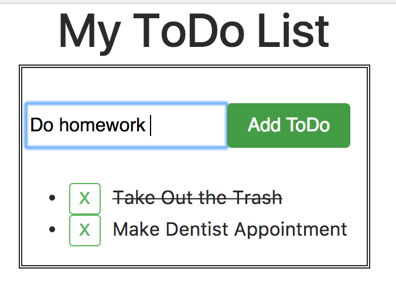
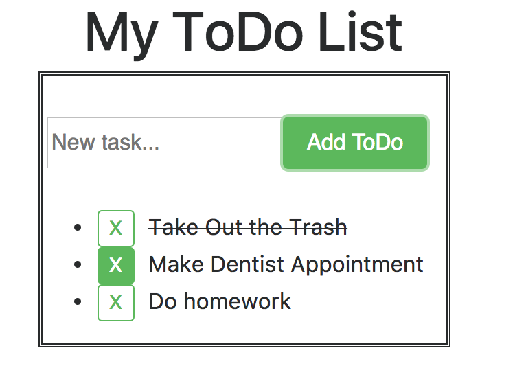
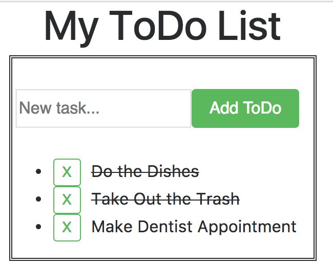

# React ToDo
In this app, users are able to compile a list of tasks they wish to complete.

The app has several features.

You can add a task by inputting a task name and pressing the 'Add task' button,

Delete a task by selecting the 'X' button for a specific task,

And mark tasks as completed by simply clicking on the text to cross it out.

## How to run
This app is configured with webpack and can be run with Node.js with the command "npm run server", after the command "npm install".

### Future improvements
- Style! The app has very simple styling, as it is a very simple app.
- Categorization of tasks in separate lists for better organization
